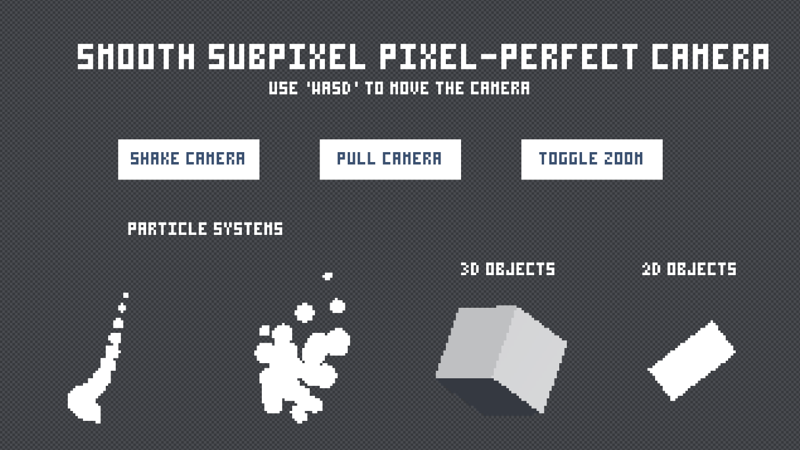

# Smooth Pixel-Perfect Camera

Achieve a low-resolution effect while keeping consistent shapes for sprites and objects that are not aligned perfectly with a grid without rough pixel snapping.
Upscaling the low-resolution effect again allows us to get sub-pixel camera movement and smooth post processing effects

Implementation:
- The scene is rendered by the World -> Pixel camera, downscaled, and sent to a render texture
    - Both the render texture and the camera are moved to the Pixel -> Screen camera's position and snapped to the nearest pixel to keep edges consistent
- Then the Pixel -> Screen camera re-renders the render texture at full resolution with the subpixel offset
    - This is where we apply post-processing effects like bloom so that those effects run at full resolution

## References

- Inspired by aarthificial, who has created an excellent explanation on the topic: https://www.youtube.com/watch?v=jguyR4yJb1M

## Known Bugs / Quirks 

- Sometimes TextMeshPro doesn't perfectly align the pixels
- Since the main camera can only see the Pixelated and UI layers, all Virtual Camera's MUST be on the Pixelated/UI layer
- UI elements and elements that you want to be able to interact with (ex. OnMouseDown()) must be on the UI layer, 
    - Otherwise the Main Camera will not render them and therefore not be able to hit them with a raycast

## Dependencies

- Cinemachine

## Installation

### Using Unity Package Manager

1. Go to **Window > Package Manager**.
2. Install [DOTween](https://assetstore.unity.com/packages/tools/animation/dotween-hotween-v2-27676#description) and follow the installation popups (no extra libraries necessary)
2. Install Cinemachine
3. Click the **+** button in the top-left corner.
4. Select **Add package from git URL...**.
5. Enter the following URL: https://github.com/ElliottHood/Effector-Values.git
